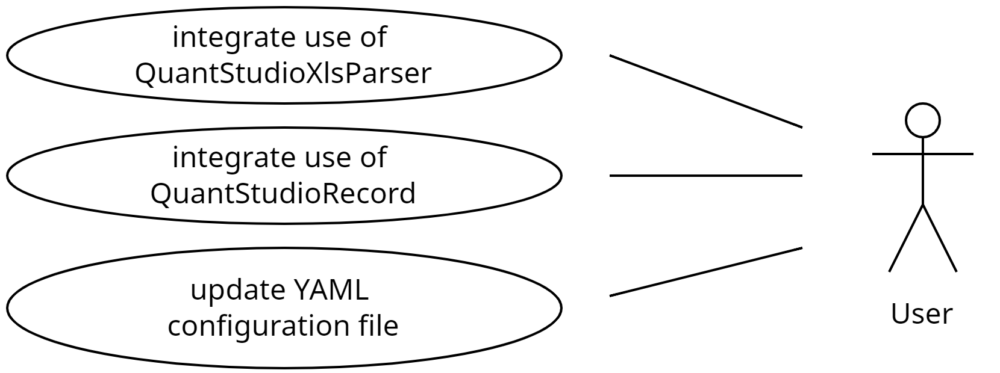
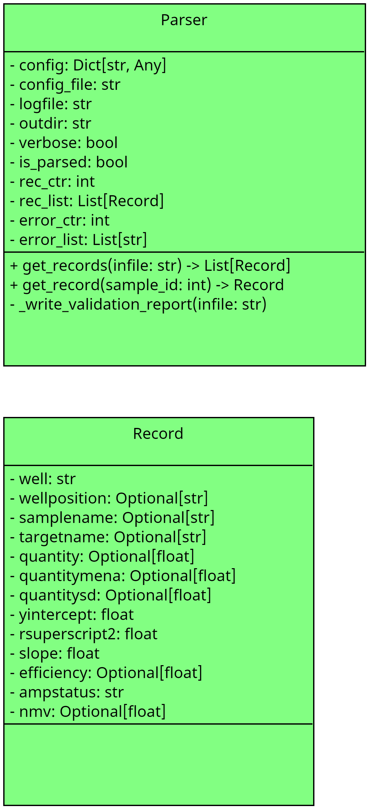

# previsedx-quantstudio-file-utils
Collection of Python modules for processing PreviseDx QuantStudio files.

- [previsedx-quantstudio-file-utils](#previsedx-quantstudio-file-utils)
  - [Improvements](#improvements)
  - [Use Cases](#use-cases)
  - [Class Diagrams](#class-diagrams)
  - [Installation](#installation)
  - [Usage](#usage)
  - [Contributing](#contributing)
  - [To-Do/Coming Next](#to-docoming-next)
  - [CHANGELOG](#changelog)
  - [License](#license)


## Improvements

Please see the [TODO](docs/TODO.md) for a list of upcoming improvements.

## Use Cases



## Class Diagrams




## Installation

Please see the [INSTALL](docs/INSTALL.md) guide for instructions.

## Usage

```python
import os
from previsedx_quantstudio_file_utils QuantStudioXlsxParser as Parser
from previsedx_quantstudio_file_utils import constants

config_file = "conf/config.yaml"
if not os.path.exists(config_file):
  config_file = constants.DEFAULT_CONFIG_FILE
config = yaml.safe_load(Path(config_file).read_text())

parser = Parser(
    config=config,
    config_file=config_file,
    logfile=logfile,
    outdir=outdir,
    outfile=outfile,
    verbose=constants.verbose,
)

infile = "quantstudio.xls"
records = parser.get_records(infile)
for record in records:
  print(f"Quantity mean is '{record.quantitymean}' for sample '{record.samplename}'")
```

## Contributing

Pull requests are welcome. For major changes, please open an issue first
to discuss what you would like to change.

## To-Do/Coming Next

Please view the listing of planned improvements [here](docs/TODO.md).

## CHANGELOG

Please view the CHANGELOG [here](docs/CHANGELOG.md).

## License

[GNU AFFERO GENERAL PUBLIC LICENSE](docs/LICENSE)
