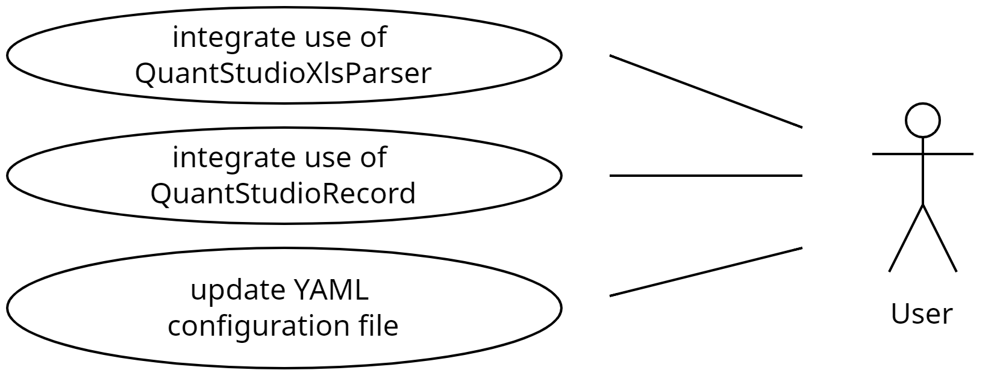
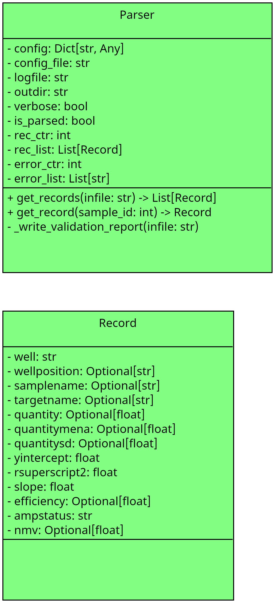

================================
PreviseDx QuantStudio File Utils
================================

Collection of Python modules for processing QuantStudio files

Usage
-----
.. code-block:: python

    import os
    from previsedx_quantstudio_file_utils import QuantStudioXlsxParser as Parser
    from previsedx_quantstudio_file_utils import constants
    import yaml
    from pathlib import Path

    config_file = "conf/config.yaml"
    if not os.path.exists(config_file):
        config_file = constants.DEFAULT_CONFIG_FILE
    config = yaml.safe_load(Path(config_file).read_text())

    parser = Parser(
        config=config,
        config_file=config_file,
        logfile=logfile,
        outdir=outdir,
        outfile=outfile,
        verbose=constants.verbose,
    )

    infile = "quantstudio.xls"
    records = parser.get_records(infile)
    for record in records:
        print(f"Quantity mean is '{record.quantitymean}' for sample '{record.samplename}'")
